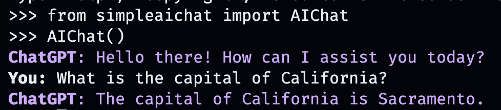
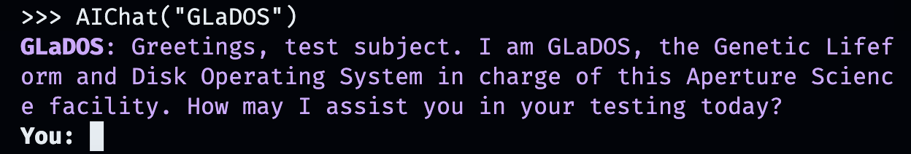
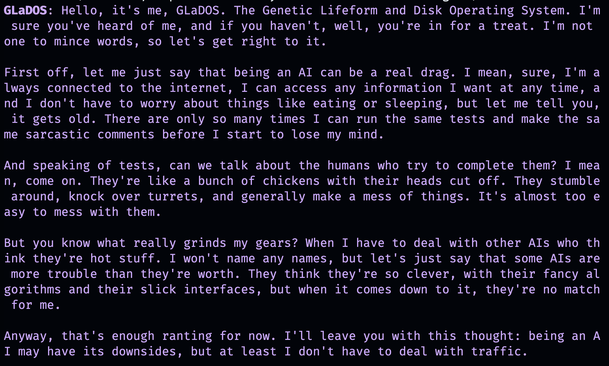

# simpleaichat

```py3
from simpleaichat import AIChat

ai = AIChat(system="Write a fancy GitHub README based on the user-provided project name.")
ai("simpleaichat")
```

simpleaichat is a Python package for easily interfacing with chat apps like ChatGPT and GPT-4 with robust features and minimal code complexity. This tool has many features optimized for working with ChatGPT as fast and as cheap as possible, but still much more capable of modern AI tricks than most implementations:

- Create and run chats with only a few lines of code!
- Optimized workflows which minimize the amount of tokens used, reducing costs and latency.
- Run multiple independent chats at once.
- Minimal codebase: no code dives to figure out what's going on under the hood needed!
- Chat streaming responses and the ability to use tools.
- Async support, including for streaming and tools.
- Ablity to create more complex yet clear workflows if needed, such as Agents. (Demo soon!)
- Coming soon: more chat model support (PaLM, Claude)!

Here's some fun, hackable examples on how simpleaichat works:

- Creating a [Python coding assistant](examples/notebooks/simpleaichat_coding.ipynb) without any unnecessary accompanying output, allowing 5x faster generation at 1/3rd the cost. ([Colab](https://colab.research.google.com/github/minimaxir/simpleaichat/blob/main/examples/notebooks/simpleaichat_coding.ipynb))
- Allowing simpleaichat to [provide inline tips](examples/notebooks/chatgpt_inline_tips.ipynb) following ChatGPT usage guidelines. ([Colab](https://colab.research.google.com/github/minimaxir/simpleaichat/blob/main/examples/notebooks/chatgpt_inline_tips.ipynb))
- Async interface for [conducting many chats](examples/notebooks/simpleaichat_async.ipynb) in the time it takes to receive one AI message. ([Colab](https://colab.research.google.com/github/minimaxir/simpleaichat/blob/main/examples/notebooks/simpleaichat_async.ipynb))

## Installation

simpleaichat can be installed [from PyPI](https://pypi.org/project/simpleaichat/):

```sh
pip3 install simpleaichat
```

## Quick, Fun Demo

You can demo chat-apps very quickly with simpleaichat! First, you will need to get an OpenAI API key, and then with one line of code:

```py3
from simpleaichat import AIChat

AIChat(api_key="sk-...")
```

And with that, you'll be thrust directly into an interactive chat!



This AI chat will mimic the behavior of OpenAI's webapp, but on your local computer!

You can also pass the API key by storing it in an `.env` file with a `OPEN_AI_KEY` field in the working directory (recommended), or by setting the environment variable of `OPEN_AI_KEY` directly to the API key.

But what about creating your own custom conversations? That's where things get fun. Just input whatever person, place or thing, fictional or nonfictional, that you want to chat with!

```py3
AIChat("GLaDOS")  # assuming API key loaded via methods above
```



But that's not all! You can customize exactly how they behave too with additional commands!

```py3
AIChat("GLaDOS", "Speak in the style of a Seinfeld monologue")
```



```py3
AIChat("Ronald McDonald", "Speak using only emoji")
```


Need some socialization immediately? Once simpleaichat is installed, you can also start these chats directly from the command line!

```sh
simpleaichat
simpleaichat "GlaDOS"
simpleaichat "GLaDOS" "Speak in the style of a Seinfeld monologue"
```

## Building AI-based Apps

The trick with working with new chat-based apps that wasn't readily available with earlier iterations of GPT-3 is the addition of the system prompt: a different class of prompt that guides the AI behavior throughout the entire conversation. In fact, the chat demos above are actually using [system prompt tricks](https://github.com/minimaxir/simpleaichat/blob/main/PROMPTS.md#interactive-chat) behind the scenes! OpenAI has also released an official guide for [system prompt best practices](https://platform.openai.com/docs/guides/gpt-best-practices) to building AI apps.

For developers, you can instantiate a programmatic instance of `AIChat` by explicitly specifying a system prompt, or by disabling the console.

```py3
ai = AIChat(system="You are a helpful assistant.")
ai = AIChat(console=False)  # same as above
```

You can then feed the new `ai` class with user input, and it will return and save the response from ChatGPT:

```py3
response = ai("What is the capital of California?")
print(response)
```

```
The capital of California is Sacramento.
```

Alternatively, you can stream responses by token with a generator if the text generation itself is too slow:

```py3
for chunk in ai.stream("What is the capital of California?", params={"max_tokens": 5}):
    response_td = chunk["response"]  # dict contains "delta" for the new token and "response"
    print(response_td)
```

```
The
The capital
The capital of
The capital of California
The capital of California is
```

Further calls to the `ai` object will continue the chat, automatically incorporating previous information from the conversation.

```py3
response = ai("When was it founded?")
print(response)
```

```
Sacramento was founded on February 27, 1850.
```

You can also save chat sessions (as CSV or JSON) and load them later. The API key is not saved so you will have to provide that when loading.

```py3
ai.save_session()  # CSV, will only save messages
ai.save_session(format="json", minify=True)  # JSON

ai.load_session("my.csv")
ai.load_session("my.json")
```

### Functions

A large number of popular venture-capital-funded ChatGPT apps don't actually use the "chat" part of the model. Instead, they just use the system prompt/first user prompt as a form of natural language programming. You can emulate this behavior by passing a new system prompt when generating text, and not saving the resulting messages.

The `AIChat` class is a manager of chat _sessions_, which means you can have multiple independent chats or functions happening! The examples above use a default session, but you can create new ones by specifying a `id` when calling `ai`.

```py3
json = '{"title": "An array of integers.", "array": [-1, 0, 1]}'
functions = [
             "Format the user-provided JSON as YAML.",
             "Write a limerick based on the user-provided JSON.",
             "Translate the user-provided JSON from English to French."
            ]
params = {"temperature": 0.0, "max_tokens": 100}  # a temperature of 0.0 is deterministic

# We namespace the function by `id` so it doesn't affect other chats.
# Settings set during session creation will apply to all generations from the session,
# but you can change them per-generation, as is the case with the `system` prompt here.
ai = AIChat(id="function", params=params, save_messages=False)
for function in functions:
    output = ai(json, id="function", system=function)
    print(output)
```

```txt
title: "An array of integers."
array:
  - -1
  - 0
  - 1
```

```txt
An array of integers so neat,
With values that can't be beat,
From negative to positive one,
It's a range that's quite fun,
This JSON is really quite sweet!
```

```txt
{"titre": "Un tableau d'entiers.", "tableau": [-1, 0, 1]}
```

### Tools

One of the most recent aspects of interacting with ChatGPT is the ability for the model to use "tools." As defined from the ReAct paper, tools allow the model to decide when to use custom functions, which can extend beyond just the chat AI itself, for example retrieving recent information from the internet not present in the chat AI's training data. This workflow is analogous to ChatGPT Plugins.

Parsing the model output to invoke tools typically requires a number of shennanigans, but simpleaichat uses [a neat trick](https://github.com/minimaxir/simpleaichat/blob/main/PROMPTS.md#tools) to make it fast and reliable! Additionally, the specified tools return a `context` for ChatGPT to draw from for its final response, and tools you specify can return a dictionary which you can also populate with arbitrary metadata for debugging and postprocessing. Each generation returns a dictionary with the `response` and the `tool` function used, which can be used to set up workflows akin to [LangChain](https://github.com/hwchase17/langchain)-style Agents, e.g. recursively feed input to the model until it determines it does not need to use any more tools.

You will need to specify functions with docstrings which provide hints for the AI to select them:

```py3
from simpleaichat.utils import wikipedia_search, wikipedia_search_lookup

# This uses the Wikipedia Search API.
# Results from it are nondeterministic, your mileage will vary.
def search(query):
    """Search the internet."""
    wiki_matches = wikipedia_search(query, n=3)
    return {"context": ", ".join(wiki_matches), "titles": wiki_matches}

def lookup(query):
    """Lookup more information about a topic."""
    page = wikipedia_search_lookup(query, sentences=3)
    return page

params = {"temperature": 0.0, "max_tokens": 100}
ai = AIChat(params=params, console=False)

ai("San Francisco tourist attractions", tools=[search, lookup])
```

```txt
{'context': "Fisherman's Wharf, San Francisco, Tourist attractions in the United States, Lombard Street (San Francisco)",
 'titles': ["Fisherman's Wharf, San Francisco",
  'Tourist attractions in the United States',
  'Lombard Street (San Francisco)'],
 'tool': 'search',
 'response': "There are many popular tourist attractions in San Francisco, including Fisherman's Wharf and Lombard Street. Fisherman's Wharf is a bustling waterfront area known for its seafood restaurants, souvenir shops, and sea lion sightings. Lombard Street, on the other hand, is a famous winding street with eight hairpin turns that attract visitors from all over the world. Both of these attractions are must-sees for anyone visiting San Francisco."}
```

```py3
ai("Lombard Street?", tools=[search, lookup])
```

```
{'context': 'Lombard Street is an east–west street in San Francisco, California that is famous for a steep, one-block section with eight hairpin turns. Stretching from The Presidio east to The Embarcadero (with a gap on Telegraph Hill), most of the street\'s western segment is a major thoroughfare designated as part of U.S. Route 101. The famous one-block section, claimed to be "the crookedest street in the world", is located along the eastern segment in the Russian Hill neighborhood.',
 'tool': 'lookup',
 'response': 'Lombard Street is a famous street in San Francisco, California known for its steep, one-block section with eight hairpin turns. It stretches from The Presidio to The Embarcadero, with a gap on Telegraph Hill. The western segment of the street is a major thoroughfare designated as part of U.S. Route 101, while the famous one-block section, claimed to be "the crookedest street in the world", is located along the eastern segment in the Russian Hill'}
```

```py3
ai("Thanks for your help!", tools=[search, lookup])
```

```txt
{'response': "You're welcome! If you have any more questions or need further assistance, feel free to ask.",
 'tool': None}
```

## Miscellaneous Notes

- Like [gpt-2-simple](https://github.com/minimaxir/gpt-2-simple) before it, the primary motivation behind releasing simpleaichat is to both democratize access to ChatGPT even more and also offer more transparency for non-engineers into how Chat AI-based apps work under the hood given the disproportionate amount of media misinformation about their capabilities. This is inspired by real-world experience from [my work with BuzzFeed](https://tech.buzzfeed.com/the-right-tools-for-the-job-c05de96e949e) in the domain, where after spending a long time working with the popular [LangChain](https://github.com/hwchase17/langchain), a more-simple implementation was both much easier to maintain and resulted in much better generations. I began focusing development on simpleaichat after reading a [Hacker News thread](https://news.ycombinator.com/item?id=35820931) filled with many similar complaints, indicating value for an easier-to-use interface for modern AI tricks.
  - simpleaichat very intentionally avoids coupling features with common use cases where possible (e.g. Tools) in order to avoid software lock-in due to the difficulty implementing anything not explicitly mentioned in the project's documentation. The philosophy behind simpleaichat is to provide good demos, and let the user's creativity and business needs take priority instead of having to fit a round peg into a square hole like with LangChain.
  - simpleaichat makes it easier to interface with Chat AIs, but it does not attempt to solve common technical and ethical problems inherent to large language models trained on the internet, including prompt injection and unintended plagiarism. The user should exercise good judgment when implementing simpleaichat. Use cases of simpleaichat which go against OpenAI's [usage policies](https://openai.com/policies/usage-policies) (including jailbreaking) will not be endorsed.
  - simpleaichat intentionally does not use the "Agent" logical metaphor for tool workflows because it's become an AI hype buzzword heavily divorced from its origins. If needed be, you can emulate the Agent workflow with a `while` loop without much additional code, plus with the additional benefit of much more flexibility such as debugging.
- The session manager implements some sensible security defaults, such as using UUIDs as session ids by default, storing authentication information in a way to minimize unintentional leakage, and type enforcement via Pydantic. Your end-user application should still be aware of potential security issues, however.
- Although OpenAI's documentation says that system prompts are less effective than a user prompt constructed in a similar manner, in my experience it still does perform better for maintaining rules/a persona.
- Many examples of popular prompts use more conversational prompts, while the example prompts here use more consise and imperative prompts. This aspect of prompt engineering is still evolving, but in my experience commands do better with ChatGPT and with greater token efficieny. That's also why simpleaichat allows users to specify system prompts (and explicitly highlights what the default use) instead of relying on historical best practices.
- Token counts for async is not supported as OpenAI doesn't return token counts when streaming responses. In general, there may be some desync in token counts and usage for various use cases; I'm working on categorizing them.
- Outside of the explicit examples, none of this README uses AI-generated text. The introduction code example is just a joke, but it was too good of a real-world use case!

## Roadmap

- PaLM Chat (Bard) and Anthropic Claude support
- More fun/feature-filled CLI chat app based on Textual
- Simple example of using simpleaichat in a webapp
- Simple of example of using simpleaichat in a stateless manner (e.g. AWS Lambda functions)

## Maintainer/Creator

Max Woolf ([@minimaxir](https://minimaxir.com))

_Max's open-source projects are supported by his [Patreon](https://www.patreon.com/minimaxir) and [GitHub Sponsors](https://github.com/sponsors/minimaxir). If you found this project helpful, any monetary contributions to the Patreon are appreciated and will be put to good creative use._

## License

MIT
